### MCP servers

- ▣ **[mcp-memory-rs](https://github.com/DioNanos/mcp-memory-rs)** — **the notebook**. Curated agent state: versioned JSON categories, BM25 search, per-device ACL, fleet sync
- ▣ **[mcp-vl-msa-rs](https://github.com/DioNanos/mcp-vl-msa-rs)** — **the library**. Corpus recall: tantivy BM25, original-text injection, remember/forget capsules
- ▣ **[mcp-email-rs](https://github.com/DioNanos/mcp-email-rs)** — **the mailbox**. Direct IMAP + SMTP for agents: read, search, organize, draft, send
- ▣ **[mcp-crewd-rs](https://github.com/DioNanos/mcp-crewd-rs)** — **the crew**. Cell fabric daemon: spawn and coordinate Claude/Codex/pi worker cells over a Unix socket, audited

Pure Rust, zero ML deps, local-first. On the [official MCP registry](https://registry.modelcontextprotocol.io)
(`io.github.DioNanos/*`) — and every claim ships with
[pre-registered negative results](https://github.com/DioNanos/mcp-vl-msa-rs/blob/main/docs/NEGATIVE_RESULTS.md).
We publish what failed, not just what worked.

### Products

- ⬢ **[codex-vl](https://github.com/DioNanos/codex-vl)** — Codex distro with a **Vivling** companion aboard: `/vivling`, `/loop`, `/goal`. Linux musl · Android · macOS
- ⬢ **[termsearch](https://github.com/DioNanos/termsearch)** — personal search engine for the terminal. One `npm install`, zero config, privacy-first
- ⬢ **[termux-ai](https://github.com/DioNanos/termux-ai)** — Termux rebuilt around per-project workspaces, made for AI CLIs
- ⬢ **[AnthMorph](https://github.com/DioNanos/AnthMorph)** — Rust API bridge: Codex ⇄ Anthropic Messages ⇄ OpenAI Chat/Responses

### Termux ports — upstream tracking

- ◈ **[codex-termux](https://github.com/DioNanos/codex-termux)** — OpenAI Codex CLI rebuilt for musl + Android ARM64 (Bionic-safe)
- ◈ **[qwen-code-termux](https://github.com/DioNanos/qwen-code-termux)** — Qwen Code tuned for Android/Termux
- ◈ **[ollama-termux](https://github.com/DioNanos/ollama-termux)** — Ollama optimized for Termux ARM64

 hatch one in the browser — it remembers you

 

Dev journal: [dev.mmmbuto.com](https://dev.mmmbuto.com) · [Sponsor](https://github.com/sponsors/DioNanos)

*Per aspera ad astra.*
