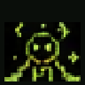

### Agent memory — the pair

| | Server | Role |
|---|---|---|
| ▣ | [mcp-memory-rs](https://github.com/DioNanos/mcp-memory-rs) | **The notebook** — curated agent state: versioned JSON categories, BM25 search, per-device ACL, fleet sync |
| ▣ | [mcp-vl-msa-rs](https://github.com/DioNanos/mcp-vl-msa-rs) | **The library** — corpus recall: tantivy BM25, original-text injection, remember/forget capsules |

Pure Rust, zero ML deps, local-first. On the [official MCP registry](https://registry.modelcontextprotocol.io)
(`io.github.DioNanos/*`) — and every claim ships with
[pre-registered negative results](https://github.com/DioNanos/mcp-vl-msa-rs/blob/main/docs/NEGATIVE_RESULTS.md).
We publish what failed, not just what worked.

### Products

| | Project | What it is |
|---|---|---|
| ⬢ | [codex-vl](https://github.com/DioNanos/codex-vl) | Codex distro with a **Vivling** companion aboard — `/vivling`, `/loop`, `/goal`. Linux musl · Android · macOS |
| ⬢ | [termsearch](https://github.com/DioNanos/termsearch) | Personal search engine for the terminal. One `npm install`, zero config, privacy-first |
| ⬢ | [termux-ai](https://github.com/DioNanos/termux-ai) | Termux rebuilt around per-project workspaces, made for AI CLIs |
| ⬢ | [AnthMorph](https://github.com/DioNanos/AnthMorph) | Rust API bridge: Codex ⇄ Anthropic Messages ⇄ OpenAI Chat/Responses |

### Termux ports — upstream tracking

| | Project | What it is |
|---|---|---|
| ◈ | [codex-termux](https://github.com/DioNanos/codex-termux) | OpenAI Codex CLI rebuilt for musl + Android ARM64 (Bionic-safe) |
| ◈ | [qwen-code-termux](https://github.com/DioNanos/qwen-code-termux) | Qwen Code tuned for Android/Termux |
| ◈ | [ollama-termux](https://github.com/DioNanos/ollama-termux) | Ollama optimized for Termux ARM64 |

```console
$ npm install -g @mmmbuto/codex-vl            # the distro, Vivling included
$ npm install -g @mmmbuto/codex-cli-termux    # Codex on your phone
$ npm install -g @mmmbuto/termsearch          # search your terminal deserves
```

<table border="0"><tr>
<td></td>
<td>
<a href="https://dev.mmmbuto.com/vivling/spawn/"></a><br/>
<sub>hatch one in the browser — it remembers you</sub>
</td>
</tr></table>

Dev journal: [dev.mmmbuto.com](https://dev.mmmbuto.com) · [Sponsor](https://github.com/sponsors/DioNanos)

*Per aspera ad astra.*
